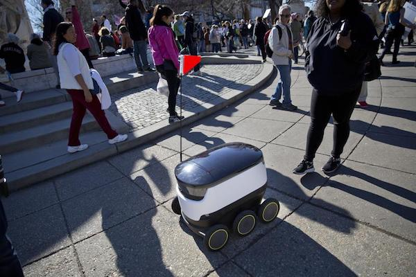

# Planning an AI-Enabled Product in a Startup

Michael Hilton, Christian Kaestner, Eunsuk Kang

---
# Discussion

----
## Discussion Questions

* What's the hypothesis behind your startup?
<!-- .element: class="fragment" -->
	* i.e., What does it mean for it to succeed?
	* e.g., "Our video streaming product will provide a reliable and accurate
      recommendation service that increases number of customers"
* What are potential risks that might cause the hypothesis to fail?
(i.e., riskiest assumptions)
Any ML related risks?
<!-- .element: class="fragment" -->
	* Data collection? Telemetry? Model quality? Security or privacy
    issues?  Safety? Ethical or legal?
	<!-- .element: class="fragment" -->
* What are ways to test your hypothesis and address these specific
risks (i.e., RAT)? What
MVPs can you use to do so?
<!-- .element: class="fragment" -->

----
## Case Study: Transcription services

* Take audio or video files and produce text
    - Used by academics to analyze interview text
    - Podcast show notes, subtitles for videos
* State of the art: Manual transcription, often mechanical turk (1.5 $/min)

----
## The startup idea

PhD research on domain-specific speech recognition, that can detect technical jargon

DNN trained on public PBS interviews + transfer learning on smaller manually annotated domain-specific corpus

Research has shown amazing accuracy for talks in medicine, poverty and inequality research, and talks at Ruby programming conferences; published at top conferences

Idea: Let's commercialize the software and sell to academics and conference organizers

----
## Case Study: Discussion Questions

* Q1. Hypothesis behind your startup?
<!-- .element: class="fragment" -->
* Q2. Potential risks that might cause the hypothesis to fail? List
three.
<!-- .element: class="fragment" -->
* Q3. MVPs to test your hypothesis and reduce the specific risks?
(i.e., RAT)
<!-- .element: class="fragment" -->

----
## Case Study #2: Delivery Robot

* Q1. Hypothesis behind your startup?
<!-- .element: class="fragment" -->
* Q2. Potential risks that might cause the hypothesis to fail? List
three.
<!-- .element: class="fragment" -->
* Q3. MVPs to test your hypothesis and reduce the specific risks? (i.e., RAT)
<!-- .element: class="fragment" -->

---
# Summary

* Startup planning as hypothesis building & testing
  * Hypothesis: What does it mean for your startup to succeed?
  * What are (ML-related) risks to a successful startup?
  * What MVPs can you build to test your hypothesis & address the risks?
